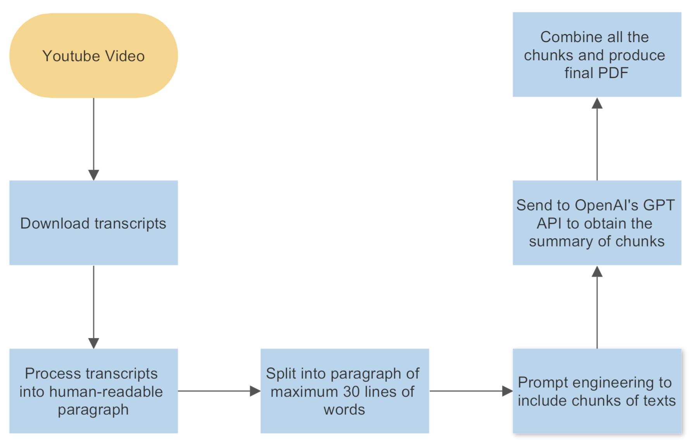

# gptLecture
> Summarise your video lecture with AI! Turn long boring video to point-form notes!

This repository contains the source code for gptLecture, a submission for iNTUition v9.0 from Team Bang2Theory.

## What it does?

1. Get your video lecture Youtube link. (We assume that most recorded lectures are uploaded to Youtube).
2. Give the Youtube link to gptLecture. gptLecture will download the video, then process the transcripts from the video.
3. The transcript will then be processed, and we used prompt engineering to ask for OpenAI’s ChatGPT to perform summarisation of the video.
4. The summary is in point form, and converted it into a PDF file for you to download!

The flow is as follows:

## How to use this code?

1. `git clone` this repository
2. `pip install -r requirements.txt`
3. Supply your OpenAI API key into a new `.toml` file. Or edit line 3 of `prompt_engineering.py`. The API key is available over [here](https://platform.openai.com/account/api-keys).
4. `streamlit run main.py`

## File Structure

1. `get_youtube_video.py`: Download the Youtube video, metadata and transcript.
2. `vtt_processor.py`: Process the downloaded transcript file (.vtt) into paragraph of texts.
3. `prompt_engineering.py`: Supply texts for OpenAI's Text Completion API to obtain the summary.
4. `main.py`: The main flow of the code, powered by Streamlit.